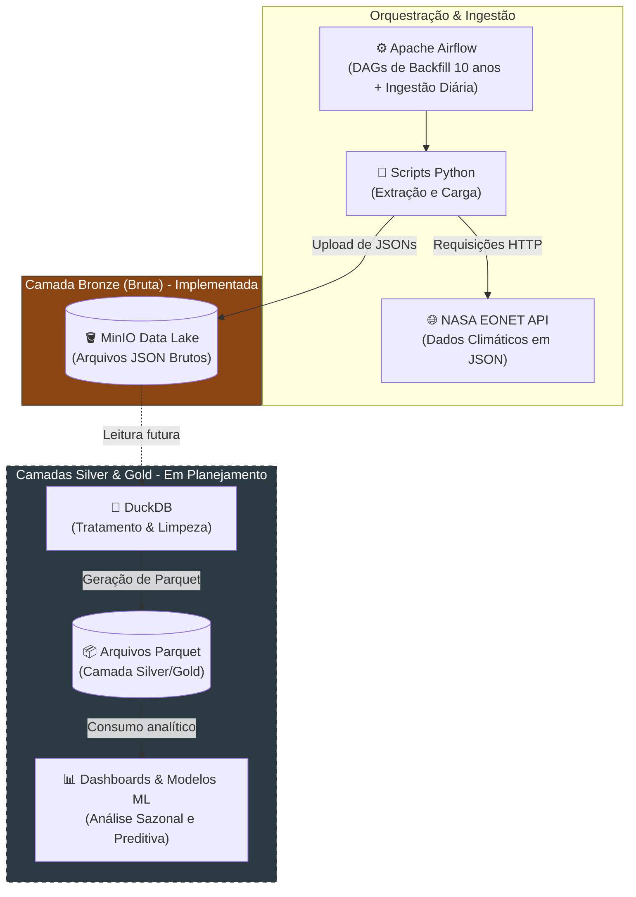

# Pipeline de Dados com API NASA EONET

## Visão Geral
Este projeto consiste na construção de uma infraestrutura de dados robusta, automatizada e escalável para coleta, processamento e análise de eventos climáticos globais disponibilizados pela **API EONET (*Earth Observatory Natural Event Tracker*) da NASA**.

O objetivo principal é estabelecer uma pipeline de dados utilizando a **Arquitetura Medallion** (Bronze, Silver e Gold), criando um repositório centralizado de inteligência climática que sirva de base para estudos avançados de Ciência de Dados.

### Objetivos do Projeto
* **Carga Histórica e Ingestão Incremental:** Execução de uma *carga histórica(backfill)* de 10 anos de eventos climáticos globais combinado com rotinas diárias de ingestão incremental.
* **Análise de Padrões e Sazonalidades:** Estruturar e organizar os dados para identificar tendências temporais, frequência e padrões geográficos de fenômenos naturais extremas.
* **Modelagem Preditiva e Machine Learning:** Preparar datasets refinados para o treinamento de modelos preditivos capazes de antecipar e classificar eventos climáticos.
* **Inteligência Visual:** Alimentar dashboards analíticos que evidenciem os principais fatores causadores, correlações e impactos desses fenômenos ao longo da última década.

---

## Diagrama de Arquitetura

---

## Status do Projeto

### Progresso por Etapa

#### 1. Ingestão & Camada Bronze (Em Andamento)
- [x] Definição da arquitetura e fluxo de dados
- [ ] Configuração do ambiente de armazenamento de objetos no **MinIO**
- [ ] Desenho e estruturação de DAGs no **Apache Airflow**
- [ ] Desenvolvimento dos scripts em **Python** para requisição e consumo da API EONET
- [ ] Execução da rotina de *backfill* histórico (10 anos de dados)
- [ ] Automação da rotina diária de ingestão incremental de JSONs brutos

#### 2. Camada Silver (Planejada)
- [ ] Leitura e parsing dos JSONs brutos via **DuckDB**
- [ ] Normalização e tratamento das estruturas aninhadas dos eventos climáticos
- [ ] Tratamento de dados ausentes, deduplicação e padronização de tipos
- [ ] Escrita dos dados limpos no formato colunar **Parquet**

#### 3. Camada Gold & Consumo (Planejada)
- [ ] Criação de visões agregadas por tipo de evento, localização geográfica e janela temporal
- [ ] Modelagem de datasets prontos para análise de padrões e sazonalidade
- [ ] Construção de dashboards analíticos com os fatores causadores dos fenômenos
- [ ] Preparação dos dados para treinamento de modelos de Machine Learning

---

## Stack Tecnológica

### Ferramentas e Tecnologias

### Detalhamento por Camada

* **Orquestração & Agendamento:** **Apache Airflow** — Gerenciamento das DAGs de *backfill* e ingestão diária incremental.
* **Extração & Ingestão:** **Python** — Scripts de integração via HTTP com a API NASA EONET e manipulação dos dados brutos.
* **Data Lake (Camada Bronze):** **MinIO** — Object Storage para armazenamento dos arquivos JSON brutos.
* **Processamento & Transformação (Camada Silver):** **DuckDB** — Leitura, normalização e limpeza dos dados semiestruturados.
* **Formato do Dado Bruto:** **JSON** — Formato semiestruturado retornado nativamente pela API NASA EONET, contendo arrays de coordenadas e metadados de eventos climáticos.
* **Formato de Armazenamento:** **Apache Parquet** — Formato colunar otimizado para consultas analíticas rápidas.
